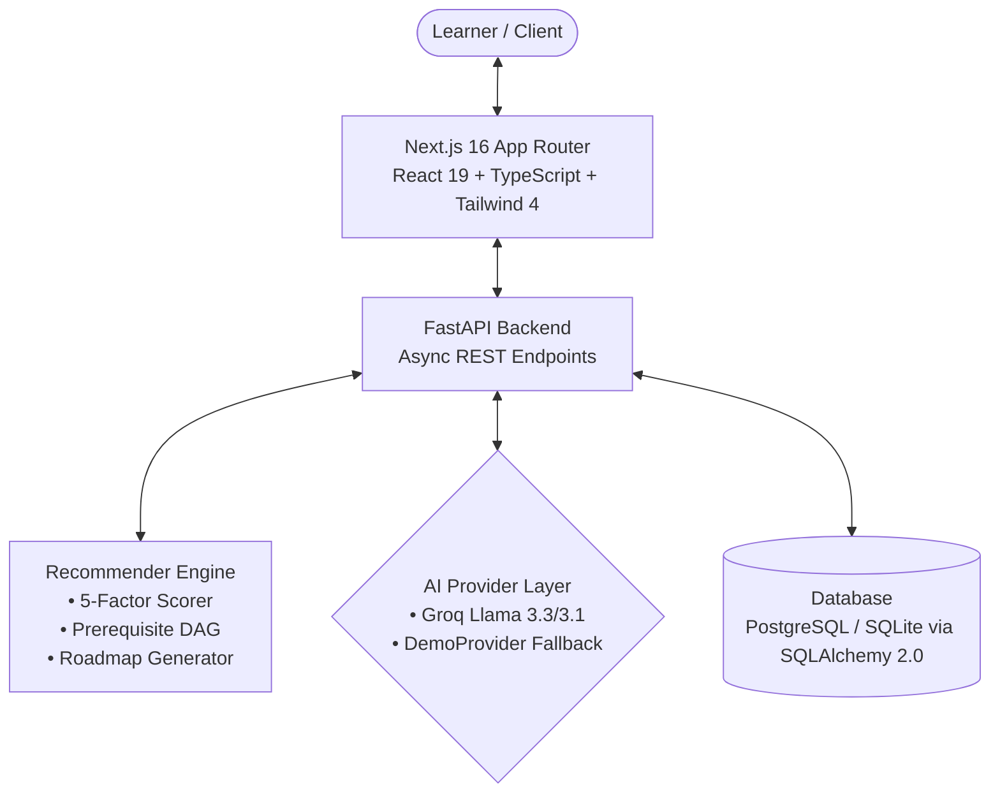

# Skillora AI

> An AI-powered personalized learning path recommender that helps learners identify skill gaps, discover relevant resources, and follow a structured learning roadmap tailored to their goals.

---

## 1. Problem Statement

Modern learners face an overwhelming abundance of online courses, tutorials, and certifications, yet they consistently encounter three critical roadblocks:
1. **One-Size-Fits-All Curricula**: Most platforms recommend popular or trending courses rather than content tailored to an individual’s specific background, existing skills, and weekly time availability.
2. **Invisible Skill Gaps**: Learners rarely know exactly which competencies they are missing for a target job role (e.g., transitioning from Python basics to an AI/ML Engineer role).
3. **Lack of Sequencing & Prerequisites**: Without a directed prerequisite graph, learners tackle advanced topics prematurely or waste time repeating foundational concepts they already know.

---

## 2. Our Solution

**Skillora AI** solves this by providing a unified, context-driven learning companion:
- **Learner Profiling**: Captures target career goals, current experience level, weekly study hours, and learning style.
- **Skill Gap Matrix**: Evaluates current proficiency against industry role standards, calculating weighted gap scores and priorities.
- **Explainable Multi-Factor Recommendations**: Recommends curated courses, articles, and videos scored across 5 dimensions with clear, human-readable justification.
- **Topological Learning Roadmap**: Generates structured, milestone-based phases that automatically respect prerequisite dependencies and adapt timeline estimates to the user’s weekly commitment.
- **Adaptive Project Blueprints & Quizzes**: Contextualizes portfolio projects with actionable milestones and evaluates progress through topic quizzes that dynamically update the learner's skill state.
- **1-on-1 AI Mentor**: Provides conversational coaching with deep context awareness of the learner's target role, strengths, gaps, and active milestones.

---

## 3. Key Features

- **Personalized Learner Profile & Onboarding**: Interactive goal setup, weekly schedule selection, and skill self-ratings with immediate profile synthesis.
- **Dynamic Skill Assessment & Gap Matrix**: Automated calculation of `gap_score = max(0, target_level - current_level)` with priority tiers (*Critical*, *High*, *Medium*, *Low*).
- **Explainable AI Recommendations**: Multi-factor scoring engine (Goal Relevance, Gap Coverage, Prerequisite Fit, Difficulty Alignment, Preference Fit) providing explicit explanations for why each resource was chosen.
- **Prerequisite-Aware Roadmap**: Phase-by-phase learning path generated via Directed Acyclic Graph (DAG) topological sorting with natural language adaptations.
- **Hands-on Project Hub**: Industry-relevant project specifications linked directly to AI Mentor blueprints for guided, step-by-step implementation.
- **Skill Quizzes & Mastery Tracking**: 15-question targeted assessments with instant scoring that automatically recalibrates user skill levels in the database.
- **Context-Aware AI Mentor**: Real-time study companion powered by Groq LLMs (with fallback) that provides concise 3-part conceptual explanations, code intuitions, and milestone guidance.
- **Comprehensive Learner Dashboard**: Live tracking of weekly study hours, streaks, active milestones, skill mastery badges, and "Next Best Action" suggestions.

---

## 4. How Personalization Works

Skillora does **not** rely on generic, static chatbot responses or plain keyword search. Instead, personalization is driven by an end-to-end data pipeline:

```text
┌───────────────────────────────┐
│     Learner Profile Setup     │  (Target Role, Experience, Weekly Hours, Style)
└───────────────┬───────────────┘
                ▼
┌───────────────────────────────┐
│   Skill Self-Ratings & Quiz   │  (Python: 3/5, ML: 1/5, SQL: 2/5)
└───────────────┬───────────────┘
                ▼
┌───────────────────────────────┐
│    Skill Gap Matrix Engine    │  (Identifies Critical Gaps & Prerequisite Chains)
└───────────────┬───────────────┘
                ▼
┌───────────────────────────────┐
│   Multi-Factor Scorer & DAG   │  (Generates Ranked Recs & Adaptive Roadmap)
└───────────────┬───────────────┘
                ▼
┌───────────────────────────────┐
│    Context-Injected AI Coach  │  (Enriches Groq LLM with Active Learner State)
└───────────────────────────────┘
```

1. **Profile Synthesis**: The learner selects a target role (e.g., *AI/ML Engineer*, *Full Stack Developer*, *Data Scientist*).
2. **Gap Calculation**: The engine compares the user's current proficiency against benchmark standards, categorizing gaps by severity.
3. **5-Factor Resource Scoring**:
   $$\text{Score} = 0.35(\text{Goal}) + 0.25(\text{Gap Coverage}) + 0.20(\text{Prereq Fit}) + 0.10(\text{Difficulty}) + 0.10(\text{Preference})$$
4. **DAG Roadmap Generation**: Topics are ordered topologically so foundational skills (e.g., Python, Linear Algebra) precede advanced topics (e.g., Deep Learning, Model Deployment), adjusting estimated weeks based on weekly study hours.
5. **Dynamic Mentor Injection**: When chatting with the AI Mentor, the system automatically builds a multi-turn prompt payload including the user's target role, priority skill gaps, active roadmap milestone, and latest assessment score.

---

## 5. AI & Recommendation Architecture

- **Primary AI Provider**: **Groq API** leveraging ultra-low latency inference with `llama-3.3-70b-versatile` / `llama-3.1-8b-instant` and open high-performance model fallbacks.
- **Offline Fallback (`DemoProvider`)**: Built-in deterministic pattern engine that guarantees 100% platform availability even in air-gapped or zero-API-key environments.
- **Structured Concept Guardrails**: Conceptual questions (*"What is recursion?"*, *"What is polymorphism?"*) strictly produce structured, beginner-friendly explanations:
  - **Definition**: 2–4 clear, intuitive sentences.
  - **Basic Example**: 1 small code snippet (2–4 lines) or clear analogy.
  - **Why it matters**: 2–3 concise bullet points connected to software engineering/ML.
- **Token & Markdown Safety**: Automatic code fence balancing and controlled token budgets prevent truncated responses.

---

## 6. System Architecture



---

## 7. Tech Stack

### Frontend
- **Framework**: Next.js 16.3.1 (App Router, Turbopack)
- **Library**: React 19.2.8
- **Language**: TypeScript 5
- **Styling**: Tailwind CSS 4, Custom Glassmorphism UI
- **Animations**: Framer Motion 13
- **State & Data Fetching**: TanStack React Query v5, Zustand v5
- **Visualizations & Markdown**: Recharts 3, React-Markdown 10, Lucide-React

### Backend
- **Framework**: FastAPI (Async Python 3.11 / 3.12)
- **ORM & Database**: SQLAlchemy 2.0 (AsyncIO), aiosqlite (Local) / asyncpg (PostgreSQL)
- **Authentication**: JWT (python-jose), Password Hashing (bcrypt / passlib)
- **Validation**: Pydantic v2 & Pydantic-Settings
- **Testing**: Pytest 8.2 + Pytest-AsyncIO

---

## 8. Project Structure

```text
Skillora/
├── backend/
│   ├── app/
│   │   ├── ai/               # Groq LLM provider, DemoProvider fallback, context builder
│   │   ├── api/              # FastAPI route endpoints (auth, roadmap, skills, chat, etc.)
│   │   ├── config/           # Pydantic environment settings
│   │   ├── database/         # Async engine, ORM models, and seed catalog
│   │   ├── models/           # SQLAlchemy models (User, Profile, Skill, Roadmap, Quiz)
│   │   ├── recommender/      # 5-factor scoring, prerequisite DAG, roadmap generator
│   │   ├── schemas/          # Pydantic request/response validation models
│   │   ├── services/         # Authentication and business logic services
│   │   └── main.py           # FastAPI entry point & CORS configuration
│   ├── tests/                # Automated pytest suite (29 test cases)
│   └── requirements.txt      # Python backend dependencies
├── frontend/
│   ├── src/
│   │   ├── app/              # Next.js App Router (Dashboard, Roadmap, Skills, Chat, etc.)
│   │   ├── components/       # Reusable UI components, Navigation, and Header
│   │   ├── lib/              # Axios API client and utility helpers
│   │   ├── store/            # Zustand global authentication and session store
│   │   └── types/            # TypeScript interfaces and data models
│   ├── public/               # Static assets and icons
│   ├── package.json          # Frontend dependencies and build scripts
│   └── tsconfig.json         # TypeScript compiler configuration
├── .env.example              # Backend environment template
├── DEPLOYMENT.md             # Production deployment guide (Vercel + Render/Railway)
├── HACKATHON.md              # Hackathon submission overview & judging alignment
└── README.md                 # Master project documentation
```

---

## 9. Local Setup & Quick Start

### Prerequisites
- **Python**: 3.11 or newer
- **Node.js**: 20 or newer
- **npm**: 10 or newer

### 1. Clone Repository
```bash
git clone https://github.com/vibhav22-raj/skillora.git
cd skillora
```

### 2. Backend Setup
```bash
# Install dependencies from root
python -m pip install -r backend/requirements.txt

# (Optional) Create .env from template
copy .env.example .env

# Start FastAPI backend
python -m uvicorn backend.app.main:app --reload --port 8000
```
*Backend API will run at `http://localhost:8000` (Swagger docs: `http://localhost:8000/docs`)*.

### 3. Frontend Setup
```bash
# Open a new terminal
cd frontend
npm install

# Start Next.js development server
npm run dev
```
*Frontend application will run at `http://localhost:3000`*.

---

## 10. Automated Testing

Skillora includes a comprehensive test suite validating auth security, skill gap algorithms, prerequisite DAG ordering, and roadmap generation.

```bash
# Run backend test suite
python -m pytest backend/tests -v

# Run frontend typecheck
cd frontend
npx tsc --noEmit
```

**Results**:
- **Pytest**: `29 passed, 0 failed` in 3.5s.
- **TypeScript**: `0 errors`.
- **Next.js Production Build**: `15/15 static routes successfully generated`.

---

## 11. Production Deployment

| Service | Recommended Platform | Configuration |
| :--- | :--- | :--- |
| **Frontend** | **Vercel** | Root directory: `frontend`, Build command: `npm run build`, Output: `.next` |
| **Backend** | **Railway / Render** | Root directory: `backend`, Start: `uvicorn app.main:app --host 0.0.0.0 --port $PORT` |
| **Database** | **Supabase / PostgreSQL** | PostgreSQL connection string via `DATABASE_URL` |

For step-by-step instructions, see [`DEPLOYMENT.md`](./DEPLOYMENT.md).

---

## 12. Future Scope

1. **Dynamic Vector Embedding Search**: Integrate `pgvector` / ChromaDB for real-time semantic matching of newly crawled educational content.
2. **Interactive Coding Sandbox**: In-browser execution environment for project milestones and code evaluations.
3. **Multi-Modal Learning Content**: AI-generated audio summaries and video walkthroughs for roadmap milestones.
4. **Peer Study Cohorts**: Collaborative roadmaps and group milestone tracking for cohort-based learning.

---

## 13. Hackathon Team & Submission

- **Project**: Skillora AI
- **Track**: AI-Powered Personalized Learning Path Recommender
- **Repository**: [https://github.com/vibhav22-raj/skillora](https://github.com/vibhav22-raj/skillora)
